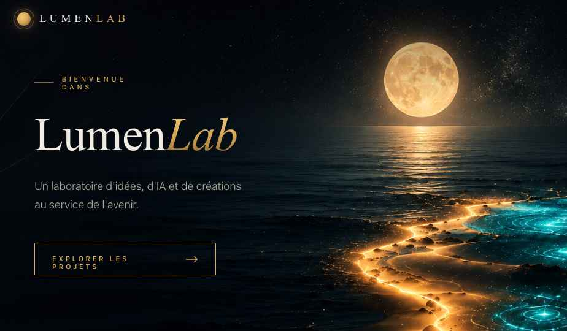

# LumenLab



Site vitrine single-page — portail vers AstraLumen et CelestIA, deux univers amenés à devenir des sites indépendants.


## Pages

| Fichier            | Rôle                                      | Statut |
|--------------------|-------------------------------------------|--------|
| `index.html`       | Portail principal (Hero · Projets · Vision) | Live   |
| `astralumen.html`  | Page WIP — AstraLumen                     | WIP    |
| `celestia.html`    | Page WIP — CelestIA                       | WIP    |

## Sections — index.html

| # | Section | id         |
|---|---------|------------|
| 1 | Hero    | `#accueil` |
| 2 | Projets | `#projets` |
| 3 | Vision  | `#vision`  |

## Structure

```
LumenLab/
├── index.html
├── astralumen.html
├── celestia.html
├── css/
│   ├── main.css              ← point d'entrée (@import)
│   ├── base/
│   │   ├── variables.css     ← tokens (couleurs, typo, espacements)
│   │   ├── reset.css
│   │   └── typography.css
│   ├── layout/
│   │   ├── header.css
│   │   ├── footer.css
│   │   └── sections.css
│   ├── components/
│   │   ├── buttons.css
│   │   ├── cards.css
│   │   ├── project-card.css
│   │   └── badges.css
│   ├── pages/
│   │   ├── home.css
│   │   └── wip.css
│   └── utilities/
│       ├── animations.css
│       └── responsive.css
├── js/
│   ├── main.js               ← orchestration
│   ├── nav.js                ← navbar scroll
│   ├── particles.js          ← particules canvas
│   └── reveal.js             ← animations au scroll
├── assets/                   ← images et logos
└── docs/
    ├── screenshots/
    ├── perf/                 ← Lighthouse avant/après
    ├── content/              ← about, archi, rapport
    └── prototype/
```

## Projets portails

- **AstraLumen** — introspection, mémoire, création
- **CelestIA** — IA, agents autonomes, créativité augmentée
- **Expériments** — prototypes et explorations technologiques

## Design

Palette : `#050810` (fond) · `#d9a85a` (or) · `#5fd4d0` (cyan) · `#f1ece1` (encre)  
Typographies : Cormorant Garamond (serif) + Manrope (sans-serif)

## Auteure

Eva Philippo — [philippoeva2@gmail.com](mailto:philippoeva2@gmail.com)
